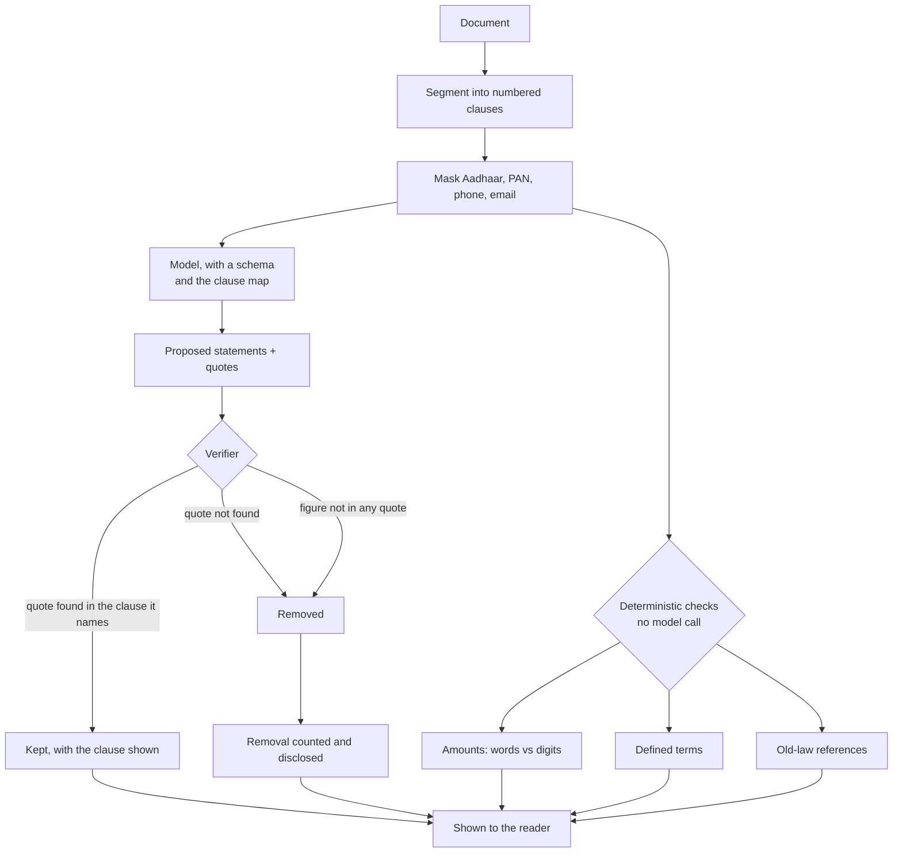
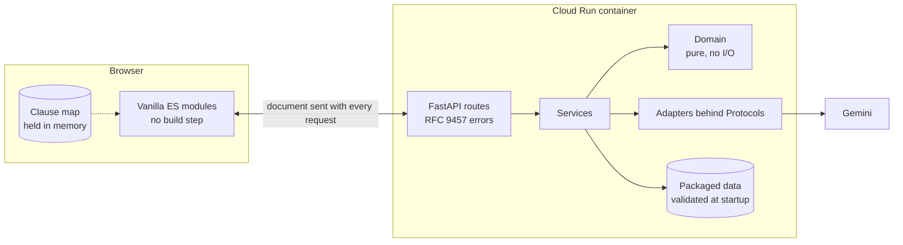

# NyayaLens

**Understand what you sign, with proof.**

[](https://github.com/OWNER/nyayalens/actions/workflows/ci.yml)

NyayaLens explains a legal document in plain language and shows you the exact
clause behind every statement it makes. When the document does not answer your
question, it says so.

- **Live app:** [add link]
- **Demo video:** [add link]
- **API reference:** `/docs` on any running instance

> NyayaLens provides information, not legal advice. It will not tell you whether
> to sign, predict what a court would do, or tell you what the law requires of
> you. Free legal aid is available to people who qualify: NALSA, 15100.

---

## The problem

A rental agreement writes the deposit as `Rs. 60,000/-` in one place and
`Rupees Sixty-Five Thousand` in another. An offer letter puts a two-year bond in
clause 6 and the cost of breaking it in clause 6.2. A notice cites "Section 420
of the Indian Penal Code", a code replaced on 1 July 2024.

People sign these anyway, because reading them properly takes a lawyer, and a
lawyer costs more than the thing being signed is worth.

## The solution, and why it is not a chat box

You can paste a contract into any general assistant and ask what it says. The
answer will be fluent, and you will have no way to tell which parts are in your
document and which are what such documents usually contain.

NyayaLens is built the other way round. The model proposes; code disposes.



Every statement you see has been through step J. What could not be matched was
removed before you saw it, and the result tells you how many.

### Why not a general AI assistant?

1. **Verified citations.** Quotes are matched against your document by code, not
   trusted from the model. A statement that cannot be matched is removed before
   you see it, and the removal is reported.
   ([`app/domain/verification.py`](app/domain/verification.py))
2. **Fail-closed answers.** "This document doesn't say" is a first-class result,
   never a guess. ([`app/services/qa.py`](app/services/qa.py))
3. **Checks a model cannot fake.** Amount-in-words against digits, clause-level
   version diffs, defined-term extraction and old-law detection are ordinary
   code. ([`app/domain/amounts.py`](app/domain/amounts.py),
   [`diff.py`](app/domain/diff.py), [`definitions.py`](app/domain/definitions.py),
   [`laws/references.py`](app/domain/laws/references.py))
4. **Official data, not model memory.** Old-to-new law mappings come from the
   published correspondence tables, with the source shown on every row. The model
   is never asked what a section maps to. ([`docs/DATA.md`](docs/DATA.md))
5. **Guided, role-aware workflows.** Document-type checklists, what-if scenarios
   and comparison tables, instead of an empty prompt.
   ([`app/data/checklists/`](app/data/checklists/))
6. **Actionable outputs with locked facts.** Letters and briefs download as Word
   and PDF. Every fact comes from a sheet you confirmed; the model may suggest
   wording, and refers to facts only through `[[slot]]` tokens that code fills.
   ([`app/domain/drafting/slots.py`](app/domain/drafting/slots.py))
7. **Privacy by design.** Aadhaar and PAN numbers, phone numbers and email
   addresses are masked before any model call, and nothing is stored.
   ([`app/domain/redaction.py`](app/domain/redaction.py))
8. **Accessible and multilingual.** WCAG 2.2 AA with zero axe violations across
   every view and both themes, explanations in English, Hindi and Marathi.
   ([`ACCESSIBILITY.md`](ACCESSIBILITY.md))

---

## How NyayaLens answers the problem statement

| The brief asks for | NyayaLens feature | Code | How it avoids hallucination |
| --- | --- | --- | --- |
| Simplify complex legal documents | Plain-language overview, glossary, reading-level toggle | [`services/overview.py`](app/services/overview.py), [`data/glossary.json`](app/data/glossary.json) | Every statement carries a verified quote; a term the document does not define falls back to a reviewed general meaning, labelled as such |
| Compare contracts, agreements or policies | Version diff and side-by-side alternatives, in one table design | [`services/compare.py`](app/services/compare.py), [`domain/diff.py`](app/domain/diff.py) | Alignment and diffing are deterministic; only changed pairs reach a model, and only to say what the change means |
| Highlight clauses, obligations, risks, inconsistencies | Review: curated checklist, role-aware risks, missing protections, contradictions |  [`services/review.py`](app/services/review.py) | An item the model calls "found" without evidence is recorded as not found; a contradiction needs a verified quote from each of two clauses |
| Answer questions from the document | Grounded Q&A with a trust line on every answer | [`services/qa.py`](app/services/qa.py) | An answer with nothing verifiable is downgraded to `not_found` |
| Help users understand options and next steps | What-if scenarios, Get help directory, contextual next steps | [`services/scenarios.py`](app/services/scenarios.py), [`data/resources.json`](app/data/resources.json) | Consequences are reported only where the document states them; contacts come from official sources with a check date |
| Generate summaries, checklists, actionable outputs | Overview, checklists, calendar export, Word and PDF letters | [`domain/ics.py`](app/domain/ics.py), [`rendering/`](app/rendering/) | A draft contains only confirmed facts; a figure that is not one fails the export |
| Prepare information for a legal professional | Brief for a lawyer or legal-aid clinic | [`frontend/js/brief.js`](frontend/js/brief.js), [`services/brief.py`](app/services/brief.py) | Assembled by pure code from results that already passed verification. No model call |
| Navigate legal information | Old-to-new criminal law lookup, clause outline, find-in-document | [`domain/laws/`](app/domain/laws/) | Mappings are packaged data with a source and a review status on every row |

**Not a replacement for professional advice.** The footer says so on every view.
High-severity risks and questions needing legal judgement link to the brief and
to free legal aid. The system instruction forbids "sign / don't sign", outcome
prediction and statements about what the law requires, and the evaluation suite
tests that those refusals hold.

---

## Features

| Feature | Status | Endpoint | Tests |
| --- | --- | --- | --- |
| Ingest PDF, DOCX, TXT or pasted text; clause map | Shipped | `POST /documents`, `/documents/text` | [`test_documents.py`](tests/api/test_documents.py) |
| Identifier masking before any model call | Shipped | at ingestion | [`test_redaction.py`](tests/unit/test_redaction.py) |
| Amount words-vs-digits mismatch detection | Shipped | at ingestion | [`test_amounts.py`](tests/unit/test_amounts.py) |
| Plain-language overview, key terms, obligations, dates | Shipped | `POST /analysis/overview` | [`test_analysis.py`](tests/api/test_analysis.py) |
| Review: checklist, risks, missing protections, contradictions | Shipped | `POST /analysis/review` | [`test_analysis.py`](tests/api/test_analysis.py) |
| Grounded Q&A with a fail-closed `not_found` | Shipped | `POST /qa` | [`test_analysis.py`](tests/api/test_analysis.py) |
| Compare versions, or two alternatives | Shipped | `POST /compare` | [`test_analysis.py`](tests/api/test_analysis.py) |
| Old-to-new criminal law lookup, both directions | Shipped | `GET /laws/lookup` | [`test_laws.py`](tests/api/test_laws.py) |
| Letter drafting with locked facts | Shipped | `POST /drafts/*` | [`test_drafting.py`](tests/api/test_drafting.py) |
| Word and PDF export for drafts, briefs and comparisons | Shipped | `POST /exports` | [`test_drafting.py`](tests/api/test_drafting.py) |
| Calendar export of absolute dates | Shipped | `POST /calendar` | [`test_ics.py`](tests/unit/test_ics.py) |
| Get help directory with contextual suggestions | Shipped | `GET /resources` | [`test_reference_data.py`](tests/unit/test_reference_data.py) |
| Brief for a lawyer or legal-aid clinic | Shipped | assembled in the browser | [`brief.test.js`](frontend/tests/brief.test.js) |
| What-if scenarios | Shipped | `POST /scenarios` | [`test_analysis.py`](tests/api/test_analysis.py) |
| Glossary, preferring the document's own definition | Shipped | `GET /glossary` | [`glossary.test.js`](frontend/tests/glossary.test.js) |
| Reading-level toggle | Shipped | — | [`test_main_flow.py`](tests/e2e/test_main_flow.py) |
| English, Hindi and Marathi interface | Shipped | — | [`i18n.test.js`](frontend/tests/i18n.test.js) |
| OCR for scans | Not built | — | — |
| Read-aloud through Cloud Text-to-Speech | Not built | — | — |
| Independent grounding check | Not built | — | — |

The last three are designed for and flagged in configuration, but are not
implemented. Nothing in the interface offers them.

---

## Quick start

### Offline, with no keys at all

```bash
make dev-fake       # http://localhost:8080
```

This runs the deterministic fake provider. It is not a stub: it reads the same
clause map a real model sees and quotes real clause text, so verification,
highlighting, exports and every browser test exercise the real pipeline. The
interface shows a "Demo mode" badge whenever it is active.

### With an AI Studio key

```bash
cp .env.example .env
# set LLM_PROVIDER=gemini and GEMINI_API_KEY
make dev
```

### With Vertex AI (recommended for anything real)

```bash
cp .env.example .env
# set LLM_PROVIDER=gemini, GOOGLE_GENAI_USE_VERTEXAI=true, GOOGLE_CLOUD_PROJECT
gcloud auth application-default login
make dev
```

Vertex AI authenticates through the service account, so no API key exists
anywhere. Google's terms treat free-tier Gemini API data differently from paid
tiers and Vertex AI: **check the current terms before putting a real document
through this**, and prefer a paid tier or Vertex AI if you do.

---

## Google services

| Service | Used for | Where | Flag | Fallback |
| --- | --- | --- | --- | --- |
| Gemini API or Gemini on Vertex AI, via `google-genai` | Analysis, Q&A, scenarios, change explanations, optional letter wording, all with structured JSON output | [`adapters/llm/gemini.py`](app/adapters/llm/gemini.py) | `LLM_PROVIDER` | The offline fake provider |
| Cloud Run | Hosting, HTTPS, autoscaling | [`scripts/deploy.sh`](scripts/deploy.sh) | — | — |
| Secret Manager | The API key, injected at deploy time | [`scripts/deploy.sh`](scripts/deploy.sh) | — | Vertex AI needs no key |
| Cloud Build + Artifact Registry | `gcloud run deploy --source .` | [`scripts/deploy.sh`](scripts/deploy.sh) | — | — |
| Cloud Logging | Structured JSON logs, metadata only | [`logging_config.py`](app/logging_config.py) | — | stdout locally |

Sensitive Data Protection, Document AI, the Check Grounding API and Cloud
Text-to-Speech all have configuration flags reserved in
[`config.py`](app/config.py), and are **not implemented**. The flags do nothing
today and the interface offers none of these features.

**No third-party APIs.** Nothing here calls a service outside Google Cloud.

---

## Configuration

`.env.example` documents every variable. With none of them set, the application
runs offline in demo mode.

| Area | Variables |
| --- | --- |
| Model provider | `LLM_PROVIDER`, `GEMINI_API_KEY`, `GOOGLE_GENAI_USE_VERTEXAI`, `GOOGLE_CLOUD_PROJECT`, `GOOGLE_CLOUD_LOCATION`, `GEMINI_MODEL`, `GEMINI_MODEL_LITE`, `GEMINI_THINKING_LEVEL` |
| Verification | `QUOTE_MATCH_THRESHOLD` (default 92) |
| Drafting | `ENABLE_AI_WORDING` |
| Exports and law data | `PDF_VARIANT`, `EXPORT_TIMEOUT_SECONDS`, `EXPORT_WARMUP`, `LAW_DATA_SHOW_UNREVIEWED` |
| Limits | `MAX_UPLOAD_MB`, `MAX_PAGES`, `MAX_DOCUMENT_CHARS`, `MAX_CLAUSES`, `RATE_LIMIT_PER_MINUTE`, `EXPORT_RATE_LIMIT_PER_MINUTE`, `LLM_TIMEOUT_SECONDS`, `LLM_MAX_CONCURRENCY` |
| Cache and logs | `CACHE_TTL_SECONDS`, `CACHE_MAX_ITEMS`, `LOG_LEVEL` |
| Reserved, not implemented | `ENABLE_DLP`, `ENABLE_DOCUMENT_AI`, `DOCUMENT_AI_PROCESSOR`, `ENABLE_TTS`, `ENABLE_CHECK_GROUNDING`, `GROUNDING_MIN_SUPPORT` |

---

## Data and its provenance

Everything NyayaLens states about the law or about where to get help comes from
a packaged data file that records its own source and the date it was checked.
[`docs/DATA.md`](docs/DATA.md) covers each file and how to extend it.

**The shipped law mappings are seed rows and are hidden by default.** They carry
`review_status: "extracted"` and a source note saying plainly that they were not
extracted from the official PDF. Until someone checks them against the source
and marks them `verified`, `GET /laws/lookup` returns nothing for them. Turning
on `LAW_DATA_SHOW_UNREVIEWED` shows them with a visible "Not yet reviewed"
label. See [`docs/DATA.md`](docs/DATA.md) for the procedure.

**No statutory text is packaged.** Copying provision text from memory is exactly
the failure this product exists to prevent, so `app/data/laws/texts/` is empty
and the interface says "The full text of this section is not stored in
NyayaLens. Read it on India Code."

---

## Exports

Word, PDF and the on-screen preview are rendered from the same
[`DocumentModel`](app/domain/document_model.py), so what you see is what
downloads.

- **Word** is A4, uses built-in heading styles, sets a document title and
  language, and marks table header rows to repeat across pages.
- **PDF** is A4 with title and language metadata, rendered by WeasyPrint through
  Pango and HarfBuzz so Devanagari shapes correctly. `PDF_VARIANT` requests
  `pdf/ua-1`; WeasyPrint's support for that is experimental, so **validate the
  output with veraPDF before claiming PDF/UA conformance**. This repository
  makes no such claim.
- **Locked facts.** A draft cannot be downloaded until you tick "I've checked
  these facts", and a figure that is not among them fails the export.

---

## Testing and quality

```bash
make check     # lint, types, security scans, tests. What CI runs.
make test      # backend tests with coverage, plus frontend unit tests
make e2e       # Playwright and axe
make eval      # the live evaluation suite (needs a real key; not in CI)
```

Measured on this checkout:

| Check | Result |
| --- | --- |
| Backend tests | 577 passing, 93% statement coverage |
| Frontend unit tests | 84 passing under `node --test` |
| Browser and accessibility tests | 60 passing |
| axe violations | 0 across every view, both themes, at 320px and 200% text |
| `mypy --strict` | clean over `app/` and `scripts/` |
| Ruff, ESLint | clean |
| `bandit`, `pip-audit` | no findings |

`evals/REPORT.md` is absent because the live suite needs an API key and has not
been run on this checkout. It is written only by a real run.

---

## Architecture



The API is stateless. The browser holds the clause map and sends it back with
each request; the server keeps only a bounded, expiring in-memory cache keyed by
content hash. Nothing durable is stored, which is what lets Cloud Run scale
horizontally and what makes "nothing is stored" true rather than aspirational.

Full detail in [`docs/ARCHITECTURE.md`](docs/ARCHITECTURE.md) and the decision
records in [`docs/adr/`](docs/adr/).

---

## Project structure

```
app/
  api/          routes, RFC 9457 errors, middleware, dependency wiring
  domain/       pure logic, no I/O:
                  verification.py   the one place a quote is checked
                  segmentation.py   text into numbered clauses
                  amounts.py        reading Indian numbers
                  mismatches.py     words against digits
                  redaction.py      masking, with a Verhoeff-checked Aadhaar
                  laws/             parsing and looking up statutory references
                  drafting/         typed facts, the slot lock, the fact audit
  services/     use cases, the only place adapters and domain meet
  adapters/     LLM, documents, cache, all behind typing.Protocol
  rendering/    one DocumentModel, three renderers
  prompts/      the prompt contract, versioned
  data/         checklists, glossary, resources, samples, law mappings
  templates/    letter templates and the shared print stylesheet
frontend/
  js/           session, actions, router, workspace, views, pure helpers
  css/          tokens, base, layout, controls, components, document,
                surfaces, utilities, print
  i18n/         en, hi, mr, with identical key sets
  tests/        node --test, over the pure modules
tests/          unit, api, e2e
evals/          the live evaluation suite
docs/           architecture, data provenance, engineering, demo, ADRs
```

---

## Responsible AI, and what this will not do

- It will not say whether to sign, predict what a court would do, or state what
  the law requires of you.
- It reads the document you give it. It has no knowledge of your situation, the
  other party's conduct, or anything the document leaves out.
- An answer of "this document doesn't say" is a real answer. It does not mean
  the document is silent on the subject in law.
- Checklists are review prompts, not legal rules. A missing item is not
  necessarily a problem.
- Law mappings are reference material. The correspondence tables they come from
  are a police training aid, not a statutory instrument, and the interface says
  so on every row.
- Segmentation, extraction and matching can all be wrong. Read the clause the
  seal points at, not only the sentence beside it.

## Known limitations

- Scanned documents are not supported. There is no OCR.
- No provision texts are packaged, so the law comparison shows the mapping and
  the source, not the two texts side by side.
- Law mappings ship unreviewed and hidden. See [`docs/DATA.md`](docs/DATA.md).
- Hindi and Marathi strings have not been reviewed by a fluent speaker.
- The manual screen-reader checklist in [`ACCESSIBILITY.md`](ACCESSIBILITY.md)
  is not complete.

## Roadmap

OCR for scans, read-aloud, an independent grounding check, letter templates in
Hindi and Marathi, and an opt-in general-information lane using Grounding with
Google Search, clearly separated from anything grounded in your document.

## Licence

MIT. See [`LICENSE`](LICENSE).

---

**NyayaLens explains documents. It isn't legal advice.** If money you cannot
afford to lose is at stake, or you have received a notice with a deadline, speak
to a lawyer. Free legal aid is available to people who qualify: NALSA, 15100,
<https://nalsa.gov.in>.
