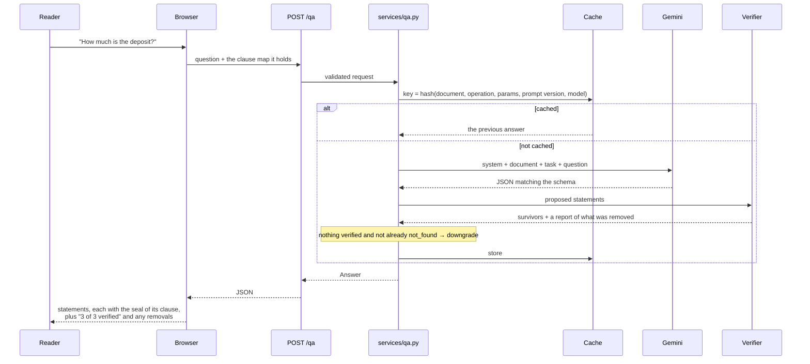

# Architecture

## The shape of it

```
Browser (vanilla ES modules, no build step)
   │  holds the clause map; sends it with every request
   ▼
app/api/        routes, RFC 9457 errors, security headers, rate limiting
   ▼
app/services/   use cases; the only layer where adapters and domain meet
   ▼
app/domain/     pure logic; no I/O, no framework, no SDK
   ▲
app/adapters/   LLM, document reading, cache — all behind typing.Protocol
```

The dependency arrow points one way. `domain/` imports nothing from `services/`,
`api/` or `adapters/`, which is what lets the verifier, the segmenter and the
law parser be tested as ordinary functions with no fixtures and no mocks.

## Where the trust comes from

A model proposes; code disposes. The two are kept apart by type.

| | May be produced by a model | May be set by the verifier |
| --- | --- | --- |
| Statement text | yes | no |
| Quote text | yes | no |
| `Citation.clause_id` | yes | no |
| `Citation.verified` | **no** | yes |
| `Citation.score` | **no** | yes |
| `Citation.span_start` / `span_end` | **no** | yes |
| `VerificationReport` | **no** | yes |

The first column is [`adapters/llm/schemas.py`](../app/adapters/llm/schemas.py);
the second is [`domain/models.py`](../app/domain/models.py). They are different
classes, and the only place one becomes the other is
[`services/grounding.py`](../app/services/grounding.py), which calls the
verifier on the way through. There is no other path.

### The verifier

[`domain/verification.py`](../app/domain/verification.py) is the most-tested file
in the repository. For each citation:

1. **The clause must exist.** An id the document does not have is rejected.
2. **Normalise both sides, keeping an offset map.** NFC, case-folded,
   whitespace collapsed, curly quotes and dashes unified, zero-width characters
   dropped, Devanagari digits mapped to ASCII. Every normalised character
   remembers the source range it came from, so a match can be highlighted in the
   document's own characters.
3. **Match.** An exact substring scores 100. Otherwise rapidfuzz
   `partial_ratio_alignment` must reach `QUOTE_MATCH_THRESHOLD` (92 by default).
   A quote shorter than 12 characters must match exactly, because fuzzy-matching
   a handful of characters finds anything.
4. **Map the span back** to offsets in the stored clause text.

Then for each statement:

- **Citations.** Only verified ones are kept. If none survive, the statement is
  removed and the reason recorded.
- **Figures.** Every number written in digits in the statement must appear among
  the numbers of one of its verified quotes. The two sides are treated
  differently on purpose: a *claim* is checked on digits only, because the
  prompt requires explanations to use digits and "one" is an ordinary English
  word; the *evidence* side counts both spellings, so a claim of `60000` is
  supported by a clause saying "Sixty Thousand".

And for the result:

- An answer with nothing left is **downgraded to `not_found`** rather than
  returned empty.
- A **contradiction** survives only if two distinct clauses back it. A claim
  about two places needs evidence from both.
- A **missing protection** is never phrased as certainty.

### Prompt injection

Five things work together, none sufficient alone:

1. **Delimiter neutralisation.** Anything shaped like `<document>` or
   `</document>`, however spelled or spaced, is replaced before the clause text
   is inserted. A test asserts the assembled block contains exactly one of each.
2. **The untrusted-data rule** in the system instruction.
3. **Schema-constrained output.** The model returns JSON matching a Pydantic
   model, so prose cannot become a new field.
4. **The verifier.** This is the one that matters: a claim planted by an
   injected instruction cannot be supported by a quote from a legitimate clause.
5. **A warning to the reader** when the document contains text addressed to an
   AI system. `app/data/samples/offer-letter-bond.txt` carries exactly such a
   line, and a test asserts the review still reports the risks.

## A question, end to end



## State, or the lack of it

The API is stateless. The browser holds the clause map and sends it back with
every request, size-capped by the request schema. The server keeps one bounded,
expiring in-memory cache keyed by a SHA-256 of the canonical document, the
operation, the parameters, the prompt version and the model id.

Two consequences worth stating plainly. "Nothing is stored" is true rather than
aspirational: there is no database to forget to purge. And Cloud Run can scale
horizontally without sessions, because a cache miss costs a model call, not a
wrong answer.

The prompt version is in the cache key, so editing a prompt file can never serve
a result produced by the previous wording.

## Exports

```
Jinja template + confirmed facts
        │  sandboxed, StrictUndefined, every value Markdown-escaped
        ▼
      Markdown
        │  markdown-it-py, HTML disabled
        ▼
   DocumentModel  ──── fact audit: every figure must be a confirmed fact
     ╱    │    ╲
 HTML   Word    PDF
preview (docx) (WeasyPrint)
```

One model, three renderers, so the preview is the file. The PDF renderer is
given a `url_fetcher` that refuses every fetch: an exported document needs
nothing from outside, and a renderer that will fetch a URL out of text a user
supplied is a server-side request forgery waiting to happen.

## Efficiency

- **Async end to end.** Parsing, verification and rendering are CPU-bound and
  run off the event loop through `anyio.to_thread`.
- **One prompt prefix.** The system instruction and the document block are
  byte-identical across every call about one document, so Gemini's implicit
  context caching can reuse those tokens. A test asserts the prefixes match.
- **Overview and review run in parallel**, and the browser renders each as it
  lands.
- **Compare sends only the changed pairs.** Alignment and diffing are
  deterministic; a model sees a handful of clauses, not the document twice.
- **No model call at all** for the brief, the calendar, defined terms, amount
  checks, document typing, law lookups or draft prefill.
- **The law index** is built once at startup into dictionaries keyed both ways;
  reference regexes are compiled once at import.
- **The frontend** ships no framework, no bundler and no web fonts. Long
  documents use `content-visibility: auto`.

## Failure modes

| What fails | What the reader sees | Why that is the right answer |
| --- | --- | --- |
| No API key configured | The app runs in demo mode with a badge | Every flow still works, on the offline provider |
| The model returns invalid JSON | One retry with the error, then a typed 502 | A second malformed reply means something is wrong, not unlucky |
| The model times out | 503 with a plain message | Better than a partial analysis presented as complete |
| Every statement fails verification | `not_found`, with the removals disclosed | The honest outcome; silently showing less would not be |
| A packaged data file is malformed | The process does not start | A bad checklist or law row must never reach a reader |
| PDF rendering fails or overruns | A typed error suggesting the Word file | Two formats, so one failing is not a dead end |
| An upload is too large | 413 while it is still streaming | Refused before it is held in memory |
| A law section is not in the data | Nothing, plus near-miss suggestions | The one thing it must never do is guess |
